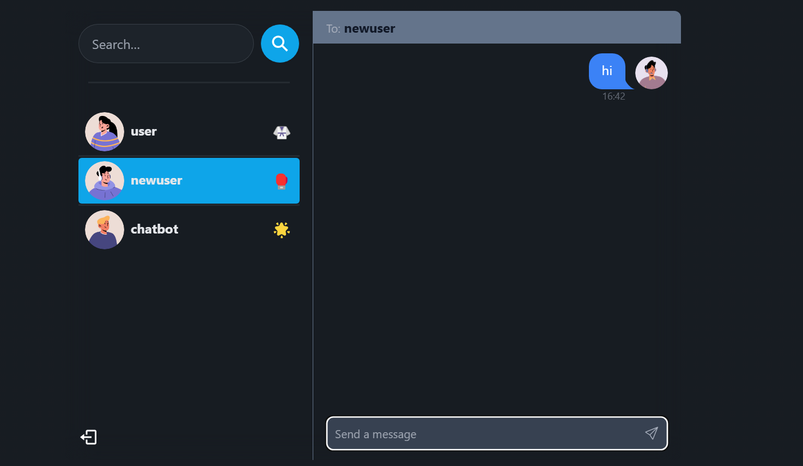

# 💬 Real-Time Chat Application

# 🚀 Features
🧑‍🤝‍🧑 One-to-One Messaging with live updates

🔒 JWT Authentication for secure login/signup

💬 Socket.io for real-time chat experience

🌐 MongoDB for storing user and message data

📲 Responsive Frontend built with Vite + React

🌈 Clean and modular codebase for easy scalability

A full-stack real-time chat app using **Node.js**, **Socket.io**, and **MongoDB** on the backend and **React + Vite** on the frontend. Built for seamless, real-time messaging with JWT-based authentication and scalable architecture.

---

## ⚙️ Tech Stack

| Layer      | Technology                                  |
|------------|---------------------------------------------|
| Frontend   | React.js, Vite, Tailwind CSS                |
| Backend    | Node.js, Express.js, Socket.io              |
| Database   | MongoDB, Mongoose                           |
| Auth       | JWT (JSON Web Token)                        |
| Realtime   | WebSockets via Socket.io                    |
| Tools      | Postman, MongoDB Compass, VS Code           |

---

## 📁 Folder Structure

```bash
.
├── controller/        # All controller logic
├── db/                # MongoDB connection setup
├── middleware/        # Auth middleware
├── model/             # Mongoose models (User, Message, etc.)
├── routes/            # Auth, User, and Message routes
│   ├── auth.js
│   ├── messages.js
│   └── users.js
├── utils/             # Token generation & management
├── socket.js          # Socket.io configuration
└── server.js          # Main server file
```

🔧 Backend Setup
Clone the repository:
```bash
git clone https://github.com/anshu-kumar27/chatapplication

cd /backend
npm i

// go back to the root file
cd ../

//install frontend
cd ./frontend
npm i
```

commands to run :
```bash
//backend
npm start

//frontend
npm run dev
```

## 🖼️ Sample Screenshots

<table>
  <tr>
    <td></td>
    <td></td>
  </tr>
</table>
